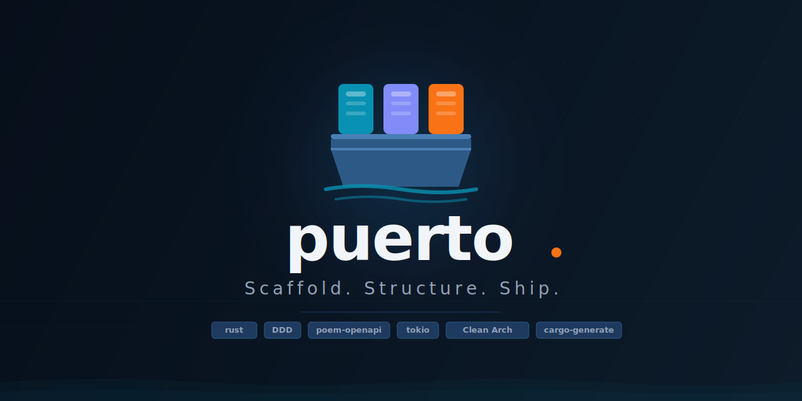

<p align="center">
  
</p>

<p align="center">
  
  
  
  
</p>

---

A Rust full-stack framework that brings the **delightful developer experience** of Laravel and Ruby on Rails to a **Domain-Driven Design** architecture.

---

## Core Principles

### 1. Delightful Coding Experience

Getting started should take seconds, not hours. `harbor new my-app` gives you a production-ready workspace with the right structure, dependencies, and conventions already in place. No boilerplate, no decision fatigue.

### 2. Truly AI-Ready

Harbor is built for the age of AI-assisted development. Rust's strict compiler acts as an **instant feedback loop** — when an AI agent generates wrong code, the compiler catches it with a precise, actionable error. No silent failures, no runtime surprises. The stronger the types, the smarter the agent.

### 3. Convention over Configuration

Harbor makes the right choices for you. Directory layout, error patterns, dependency injection, testing conventions — all standardized. When every Harbor project looks the same, AI agents and human developers can navigate any codebase from day one.

---

## Why DDD Instead of MVC

MVC is a great starting point, but it doesn't scale well. As applications grow, business logic leaks into controllers and models, making code harder to test and reason about.

Harbor generates projects around **Domain-Driven Design** and **Clean Architecture**:

- **Domain** is pure Rust — no framework dependencies, no infrastructure concerns. Business rules live here.
- **Application** orchestrates the domain — use cases are explicit, testable units of behavior.
- **Infrastructure** adapts external systems (databases, HTTP clients) to domain contracts.
- **Presentation** exposes the application via HTTP — it's just another adapter.

The result: a codebase where business logic is isolated, always testable, and never coupled to the framework.

---

## Architecture

Every Harbor project is a Cargo workspace with three crates:

```
my-app/
├── business/          # Pure Rust — domain models, errors, use cases
│   └── src/
│       ├── domain/    # Entities, repository traits, use case traits
│       └── application/ # Use case implementations
├── infrastructure/    # Adapters — repositories, HTTP clients, etc.
│   └── src/
└── presentation/      # HTTP API — poem-openapi routes, DTOs, error mapping
    └── src/
```

**Dependency rule (inward only):**

```
Presentation → Infrastructure → Application → Domain
```

The domain depends on nothing. Everything else depends on the domain.

---

## Getting Started

```bash
# Install Harbor
cargo install harbor-framework

# Scaffold a new project
harbor new my-app

# Enter the project and run
cd my-app
cargo run
```

Visit `http://localhost:8080` for the Swagger UI, or call the API directly:

```bash
curl http://localhost:8080/api/greetings/World
```

---

## Project Structure (Harbor itself)

Harbor is also a Cargo workspace:

```
harbor/
└── crates/
    └── cli/                # The harbor binary (cargo-generate wrapper)
        ├── src/            # CLI source
        └── template/       # The "basic" project template (edit directly here)
```

| Command | Description |
|---|---|
| `make run` | Run the harbor CLI |
| `make test` | Fast structural tests |
| `make test/full` | Full test: generates a project + compiles + runs its tests |
| `make lint` | Clippy with `-D warnings` |
| `make format` | rustfmt |
| `make check` | cargo check |
